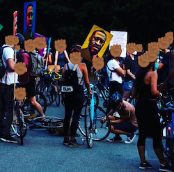
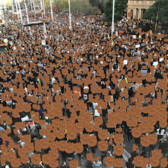
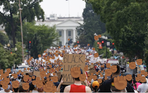

<p float="left">
    
    
    
</p>

# Anonymize BLM Protest Images

This repository automates [@BLMPrivacyBot](https://twitter.com/blmprivacybot), a Twitter bot that shows the anonymized images to help keep protesters safe. Use our interface at [blm.stanford.edu](http://blm.stanford.edu).


### What's happened? Arrests at protests from public images
Over the past weeks, we have seen an increasing number of **arrests at BLM protests**, with images circulating around the web enabling automatic identification of those individuals and subsequent arrests to hamper protest activity. This primarily concerns social media protest images.

Numerous applications have emerged in response to this threat that aim to anonymize protest images and enable people to continue protesting in safety. Of course, this would require a shift on the public's part to recognize this issue and an easy and effective method for anonymization to surface. In an ideal world, platforms like Twitter would enable an on-platform solution.


### So what's your goal? AI to help alleviate some of the worst parts of AI
The goal of this work is to leverage our group's knowledge of facial recognition AI to offer the most effective anonymization tool that evades the state of the art in facial recognition technology. AI facial recognition models _can_ still recognize blurred faces. This work tries to discourage people from trying to recognize or reconstruct pixelated faces by masking people with an opaque mask. We use the BLM fist emoji as that mask for solidarity. While posting anonymized images does not delete the originals, we are starting with awareness and hope Twitter and other platforms would offer an on-platform solution (might be a tall order, but one can hope).

Importantly, this application does not save images. We hope the transparency of this repository will allow for community input. The Twitter bot posts anonymized images based on the Fair Use policy; however, if your image is used and you'd like it to be taken down, we will do our best to do so immediately.


### Q&A

**How can AI models still recognize blurred faces, even if they cannot reconstruct them perfectly?** Recognition is different from reconstruction. Facial recognition technology can still identify many blurred faces and is better than humans at it. _Reconstruction_ is a much more arduous task (see the difference between discriminative and generative models, if you're curious). Reconstruction has recently been exposed to be very biased (see lessons from [PULSE](https://thegradient.pub/pulse-lessons/)). Blurring faces has the added threat of encouraging certain people or groups to de-anonymize images through reconstruction or directly identifying individuals through recognition.

**Do you save my pre-anonymized images?** No. The goal of this tool is to protect your privacy and saving the images would be antithetical to that. We don’t save any images you give us or any of the anonymized images created from the AI model (sometimes they’re not perfect, so saving them would still not be great!). If you like technical details: the image is passed into the AI model on the cloud, then the output is passed back and directly displayed in a base64 jpg on your screen.

**The bot tweeted my image with the fists on it. Can you take it down?** Yes, absolutely. Please DM the bot or reply directly.

**Can you talk a bit more about your AI technical approach?** We build on state-of-the-art crowd counting AI, because it offers huge advantages to anonymizing crowds over traditional facial recognition models. Traditional methods can only find a few (less than 20 or even less than 5) in a single image. Crowds of BLM protesters can number in the hundreds and thousands, and certainly around 50, in a single image. The model we use in this work has been trained on over 1.2 million people in the open-sourced research dataset, called [QNRF](https://www.crcv.ucf.edu/research/data-sets/ucf-qnrf/), with crowds ranging from the few to the the thousands. False negatives are the worst error in our case. The pretrained model weights live in the [LSC-CNN](https://github.com/val-iisc/lsc-cnn) that we build on - precisely, it's in a Google Drive folder linked from their README.


### Other amazing tools
We would love to showcase other parallel efforts (please propose any we have missed here!). Not only that, if this is not the tool for you, please check these tools out too:
* [Image Scrubber](https://everestpipkin.github.io/image-scrubber/) by @everestpipkin
* Censr (iOS and Android app)

[And more...](https://www.theverge.com/21281897/how-to-hide-faces-scrub-metadata-photograph-video-protest)


## Built by and built on

0. This work is built by the Stanford Machine Learning Group. 
We are Krishna Patel, JQ, and Sharon Zhou.

1. Flask-Postgres Template by @sharonzhou

```
https://github.com/sharonzhou/flask-postgres-template
```

2. Image Uploader by @christianbayer

```
https://github.com/christianbayer/image-uploader
```

3. LSC-CNN by @vlad3996
```
https://github.com/vlad3996/lsc-cnn
```

Paper associated with this work:
```
@article{LSCCNN20,
    Author = {Sam, Deepak Babu and Peri, Skand Vishwanath and Narayanan Sundararaman, Mukuntha,  and Kamath, Amogh and Babu, R. Venkatesh},
    Title = {Locate, Size and Count: Accurately Resolving People in Dense Crowds via Detection},
    Journal = {IEEE Transactions on Pattern Analysis and Machine Intelligence},
    Year = {2020}
}
```


